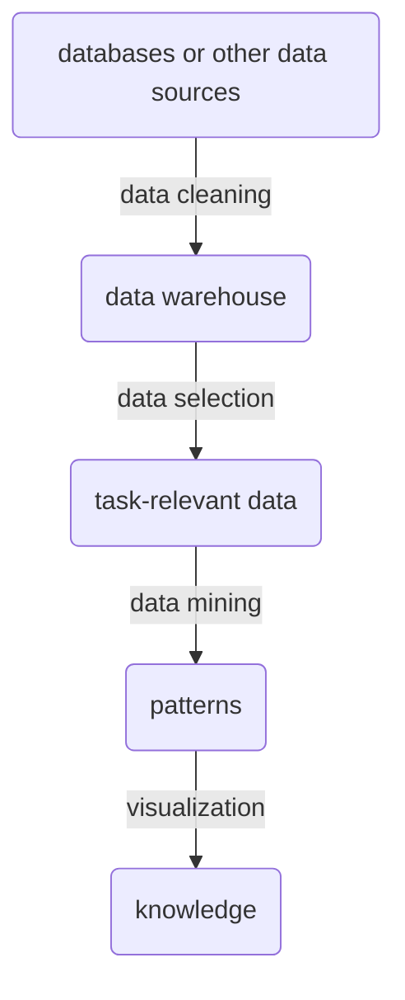

# Big data basics

## Resources

- [Mining of Massive Datasets (Stanford University)](http://www.mmds.org/)
- [Lecture ETH Zürich](https://systems.ethz.ch/education/courses/2024-autumn-semester/big-data.html)

## Goal of data analysis

Decision making often involves uncertainty (uncertain situations, uncertain impacts).
We assume that existing data contains information that we can use
to model uncertain situations, predict outcomes, or unknown parameters.

Related disciplines: statistics, artificial intelligence, machine learning,
data mining and knowledge discovery, deep learning, reinforcement learning.

## Knowledge discovery process

## V model of big data

The initial three V's are:

- **volume**:
  huge amount of data so large that it cannot be analyzed using traditional methods;
  high number of instances or features
- **variety**:
  large proportion of data is unstructured; there are different types of data
  (e.g. spreadsheets, images, videos); different data formats
- **velocity**:
  data can be generated, changed and analyzed within short time spans
  (e.g. milliseconds)

Additionally suggested V's:

- **veracity / validity**:
  credibility of the data, the high volume of data leads to different degrees
  of data quality;
  interfering factors can be noise, manipulation or misinterpretation
- **value**:
  added value by investments of companies in big data infrastructure

## Different types of tasks

- classification
  - e.g. image classification, document categorization
- regression
  - e.g. housing values
- clustering
  - e.g. customer segmentation
- outlier detection
- frequent itemset mining
  - e.g. market-basket analysis
- ...

## Application examples

- image recognition
- image processing
- speech recognition
- automatic translation
- game AIs:
  - Deepmind AlphaGo (go), AlphaZero (chess), AlphaStar (StarCraft)
  - OpenAI Five (Dota2)
- material requirement planning for manufacturing
- predict capacity utilisation of the passenger train (Deutsche Bahn)

